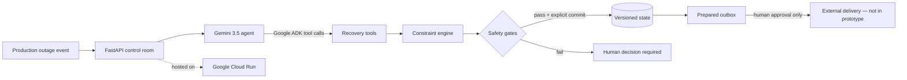

# Places, Again

[](https://deploy.cloud.run?git_repo=https://github.com/rarescos-pixel/places-again&revision=main)

The button above opens Google's guided Cloud Run deployment. The repository's
`app.json` prepares the required APIs, Firestore database, bounded public-demo
settings, and dedicated runtime identity, then runs an end-to-end smoke test.

**Places, Again** is a same-day recovery agent for live productions. A performer
or specialist disappears from the plan; the agent identifies every
affected call, finds a qualified cover, changes only what it must, verifies the
new schedule, commits a versioned plan, and prepares bilingual call sheets in a
human-approved outbox.

The opera scenario is an authentic, high-friction test bed. The underlying
workflow applies to theatre, film, festivals, conferences, broadcast, and other
live operations where one disruption cascades across people, rooms, and time.

## The narrow claim

This is not another production calendar. Existing tools already schedule calls
and flag conflicts. Places, Again focuses on the failure moment: autonomous,
policy-bounded low-change recovery after a same-day disruption, with explicit safety
gates, a version check, and an auditable unsent outbox.

## Why it is agentic

Gemini 3.5 and Google Agent Development Kit decide which tools to call and in
what order. A production event makes the tools read current state, simulate a
recovery, commit a safe plan, prepare call sheets, and inspect the audit log.
Deterministic code owns the constraints and irreversible boundaries; the model
cannot silently bypass a failed safety check or send a message.

## Architecture




Local mode uses a JSON repository so it is reproducible and costs nothing to
run. Cloud mode switches to Firestore so previewed plans, versions, audit events,
and the outbox survive Cloud Run instance changes. State transitions use a
Firestore transaction, so concurrent Cloud Run instances cannot both commit a
plan against the same version.

## Five-minute local demo

```bash
python -m venv .venv
.venv/bin/pip install -r requirements-dev.txt
.venv/bin/uvicorn places_again.web:app --reload
```

Open `http://127.0.0.1:8000`, then either:

1. trigger the complete Gemini/ADK workflow with **Simulate 08:05 outage
   event**; or
2. use **Inspect deterministic plan** and **Commit inspected plan** to examine
   the safety boundary without an external model call.

In both paths, inspect the proposed replacements, time shifts, four safety gates,
versioned schedule, tool/audit trace, and bilingual call sheets. Call sheets
remain `prepared_not_sent`.

The preview is deterministic and needs no external service. All names and
production details are synthetic.

## Gemini / Google ADK path — local API key

```bash
export GEMINI_API_KEY=your_key
export PLACES_AGAIN_MODEL=gemini-3.5-flash
.venv/bin/uvicorn places_again.web:app --reload
```

Use **Simulate 08:05 outage event** in the interface, or call:

```bash
curl -X POST http://127.0.0.1:8000/api/events/person-unavailable \
  -H 'content-type: application/json' \
  -d '{"disruption":{"person_id":"soprano_principal","start":"08:00","end":"14:00","reason":"same-day illness"},"reset_demo":true}'
```

The response includes the agent's answer and its tool-call trace.

## Safety contract

- A replacement must have every skill required by the unavailable person.
- Participant availability, room collisions, and person collisions are checked.
- Sessions not affected by the disruption are never moved by this policy.
- A plan is rejected if the state version changed after analysis.
- Unresolved plans cannot be auto-committed.
- Commit requires an explicit action.
- Messages are prepared, persisted, and audited, but never sent.

## Tests

```bash
python scripts/verify_core.py
.venv/bin/pytest -q
```

The first command verifies the deterministic engine without third-party test
packages. The pytest suite also verifies the HTTP API, repository adapters,
stale-plan rejection, and unsent-message boundary.

## Google Cloud Run

The preferred Cloud Run path uses Vertex AI through the service identity, so no
Gemini key file is copied into the container:

From Google Cloud Shell, the checked recovery and deployment path is one command:

```bash
bash deploy.sh
```

The script targets the contest project by default, records the most recent
`europe-west1` build and its log, checks that billing is already enabled, and
uses an explicit least-privilege build identity instead of relying on Google's
changing default Cloud Build account. It then creates the runtime identity,
provisions Firestore when needed, deploys with zero minimum instances and one
maximum instance, permits one request at a time, limits the public Gemini path
to 12 runs per hour, and runs the public smoke test. A failed first deployment
gets one bounded IAM-propagation retry. The complete result is left in
`runtime/deployment-report-latest.txt`. The deterministic preview does not call
Gemini and remains available after the public-agent safety limit. The script
never creates or downloads a service-account key and never attaches a billing
account.

The equivalent manual commands are retained below for inspection and recovery:

```bash
export GOOGLE_CLOUD_PROJECT=your-project-id
gcloud config set project "$GOOGLE_CLOUD_PROJECT"
gcloud services enable run.googleapis.com cloudbuild.googleapis.com \
  aiplatform.googleapis.com firestore.googleapis.com
gcloud firestore databases create --location=europe-west1

gcloud run deploy places-again \
  --source . \
  --region europe-west1 \
  --allow-unauthenticated \
  --min-instances 0 \
  --max-instances 1 \
  --memory 512Mi \
  --cpu 1 \
  --concurrency 1 \
  --set-env-vars PLACES_AGAIN_MODEL=gemini-3.5-flash,PLACES_AGAIN_REPOSITORY=firestore,PLACES_AGAIN_AGENT_RUNS_PER_HOUR=12,GOOGLE_GENAI_USE_VERTEXAI=TRUE,GOOGLE_CLOUD_PROJECT="$GOOGLE_CLOUD_PROJECT",GOOGLE_CLOUD_LOCATION=global
```

The Cloud Run service identity needs the least-privilege
`roles/datastore.user` and `roles/aiplatform.user` roles. When deployed,
`/api/capabilities` reports the Cloud Run service, revision, and repository
from `K_SERVICE` and `K_REVISION`; locally it says `local`. This gives the demo
visible proof of where the backend is running without hard-coded claims.

After deployment, verify all three mandatory Google layers in one run:

```bash
python scripts/smoke_test.py https://YOUR-SERVICE-URL.run.app
```

## Submission assets still requiring the owner

- Google Cloud project with billing and the required APIs enabled
- Cloud Run deployment and smoke test
- Public 4-minute-or-shorter YouTube or Vimeo demo
- Devpost entry and contributor identity
- Final eligibility self-attestation

## License

Created by Rareș Păltineanu. MIT licensed; see `LICENSE`.
