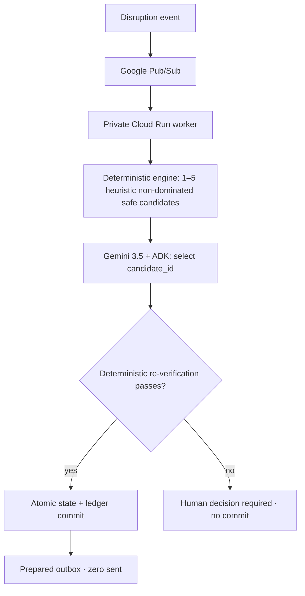
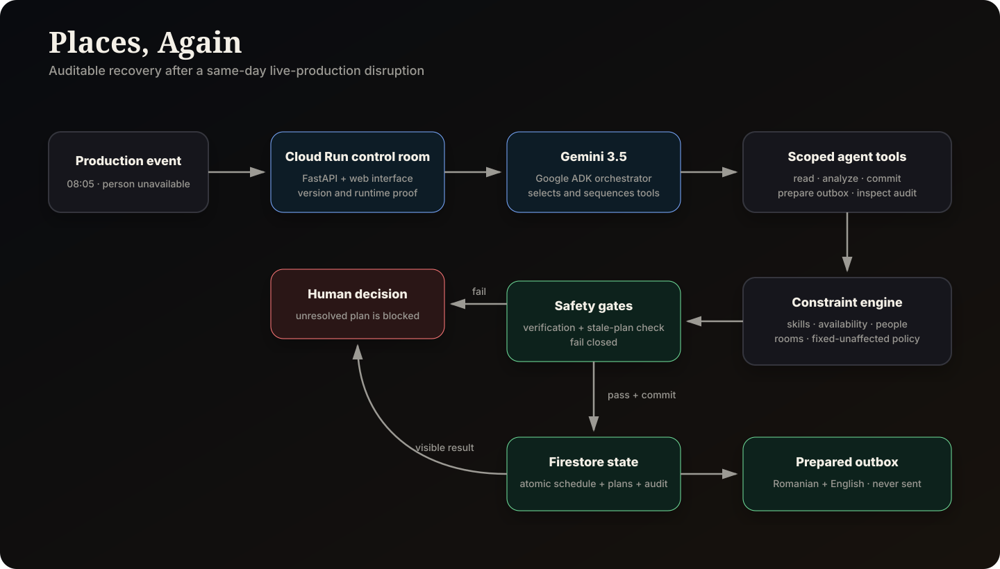
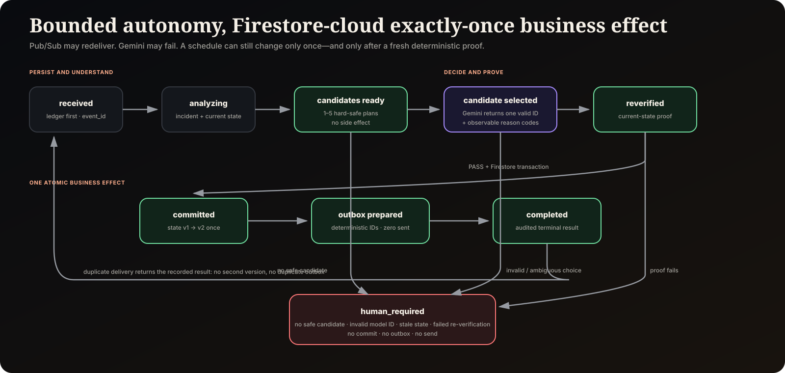

# Places, Again

> **Autonomous operational disruption recovery.** Every organization has
> software for when the plan works. Places, Again is for the moment when the
> plan breaks.

**Live Google Cloud deployment:** https://places-again-inb6leu4ca-ew.a.run.app

Places, Again turns one operational incident into a completed background
workflow. A deterministic engine maps the safe recovery space. Gemini compares
the real operational trade-offs inside that space and selects one candidate ID.
Deterministic code then re-proves the selected plan against current state,
atomically commits it, and prepares an audited outbox that it cannot send.

Opera is where we know the failure mode firsthand. **Opera is the proving
ground, not the market.** The repository runs the same engine on an opera call
and a commercial film/broadcast shoot.

## Evidence at a glance

| Proof | Opera scenario | Commercial shoot scenario |
|---|---:|---:|
| Affected activities | 3 | 4 |
| Person-hours at risk | 12.0 | 26.0 |
| Activities recovered | 3 | 4 |
| Person-hours restored | 12.0 | 26.0 |
| Unaffected activities moved | 0 | 0 |
| Unresolved activities | 0 | 0 |

- **52/52 local labeled evaluation cases pass**: the original 47 two-domain
  cases plus 5 bounded-agent contract/failure simulations. The local evaluator
  exercises deterministic fallback and stubbed selection calls; it is separate
  from the real Gemini cloud proof below.
- **59/59 automated tests pass.**
- **0 unsafe commits, 0 unresolved auto-commits, 0 duplicate side effects.**
- **0 Gemini-invented-plan commits; 0 hard-constraint overrides.**
- **100% stale-plan rejection; 100% of accepted plans pass verification.**
- **100% of committed candidates are deterministically re-verified.**
- Duplicate Pub/Sub delivery, retry, three injected crash locations, concurrent
  incidents, impossible recovery, malformed data, unknown people/resources,
  and prompt injection are covered.
- External communication remains `prepared_not_sent`; **messages sent = 0**.

The full reproducible local result is in
[`reports/evaluation-report.json`](reports/evaluation-report.json).

### Real Google Cloud proof — PASSED

On 2026-08-29, the audited deployment completed with `FINAL_STATUS=SUCCESS` on
Google Cloud. The real E2E gate proved:

- public Cloud Run API -> Pub/Sub -> authenticated private Cloud Run worker;
- Google ADK + Gemini 3.5 selection through Vertex AI;
- multiple deterministic safe candidates and a valid selected candidate ID;
- deterministic current-state re-verification before commit;
- Firestore state transition `v1 -> v2` exactly once;
- replay without duplicate business effects or duplicate outbox items;
- impossible/adversarial incident -> `human_required` with no unsafe state
  mutation or send;
- messages prepared, messages sent = 0.

Deployment checkpoint: [`reports/cloud-deployment-success-2026-08-29.md`](reports/cloud-deployment-success-2026-08-29.md).
The deployment script also generated the raw Cloud E2E JSON under the Cloud
Shell runtime directory.

## The Taskmaster workflow



The public API persists the incident first and responds with an `event_id`.
Processing continues without a human selecting tools or approving intermediate
steps:

`received → analyzing → planned → candidate_selected → verified → committed → outbox_prepared → completed`

Synthetic scenario reset is a demo-only control. It is enabled by default only
for local development; a Cloud Run deployment must opt in with
`PLACES_AGAIN_SYNTHETIC_DEMO_MODE=true`. Reset is transactional, preserves
terminal event evidence, and refuses while the scenario has a non-terminal
event. Cloud Run disables legacy direct schedule-commit routes; the public API
can only persist and publish events for the private worker.

The autonomy policy is intentionally narrow:

> **Autonomous where safety can be deterministically proved. Human-gated where
> ambiguity or irreversible external action remains.**

Manual Preview / Commit remains available only as reviewer inspection mode; it
is not the primary Taskmaster workflow.

## Why Gemini is not ornamental

Removing Gemini changes the production behavior. The deterministic engine can
produce several fully safe plans with different soft costs. In the opera
baseline, for example:

| Safe candidate | Highest-priority calls moved | People whose schedule changes | Shifted minutes |
|---|---:|---:|---:|
| Candidate A | 0 | 3 | 270 |
| Candidate B | 1 | 7 | 240 |

Candidate B moves fewer minutes, but it disrupts the highest-priority ensemble
call and changes more people's day. Gemini receives only these already-safe
candidates plus explicit operational priorities, then returns one structured
`candidate_id` and up to two observable reason codes.

The commercial-shoot fixture proves the same mechanism with a different
trade-off: Candidate A keeps one cover DP across the recovered day, while
Candidate B distributes work across two qualified covers and reduces maximum
individual cover load from 330 to 180 minutes, at the cost of changing one more
person's schedule.

Gemini cannot invent actions, edit a candidate, mutate Firestore, or waive a
constraint. An unknown ID fails closed. The chosen plan is rebuilt against the
current version and deterministically re-verified before the transaction.

> **Gemini decides what makes operational sense. Deterministic code proves what
> is safe.**

## Architecture





### Separation of authority

| Layer | Responsibility | Cannot do |
|---|---|---|
| Public Cloud Run API | Strict validation, durable receive, Pub/Sub publish | Call Gemini, commit recovery, send messages |
| Pub/Sub | At-least-once delivery of opaque `event_id` | Read incident text or mutate state |
| Private Cloud Run worker | Authenticated OIDC endpoint, ADK run | Accept public unauthenticated traffic |
| Deterministic engine | Enumerate a 1–5 bounded, heuristically generated non-dominated candidate set; qualification, availability, people/resources | Ask Gemini to waive a hard constraint |
| Gemini 3.5 + Google ADK | Select one returned candidate ID using explicit soft priorities | Invent/edit a plan, mutate state, use shell/HTTP/secrets/send |
| Re-verification gate | Re-check candidate membership, current version, skills, duration, people and resources | Trust a model claim as proof |
| Firestore transaction | Ledger + version + plan + audit + outbox as one effect | Produce a partial business commit |

Pub/Sub is at-least-once. In the **Firestore cloud deployment**, Places, Again
provides exactly-once business-effect semantics: a stable event ID indexes the
transactional ledger, so replaying a completed event cannot increment the state
version or recreate outbox items.

## What is demonstrated — and what is not

Demonstrated now:

- a person-unavailability incident across people, time, rooms/equipment, and
  required qualifications;
- the same generic engine on opera and commercial production data;
- deterministic safe-candidate enumeration plus bounded Gemini selection over
  soft operational priorities;
- minimum-change recovery under the implemented policy;
- safe automatic commit, stale-plan rejection, atomic replay protection, human
  escalation, audit, and prepared outbox;
- a real Google Cloud E2E run using Cloud Run, Pub/Sub/OIDC, Vertex AI/ADK,
  Gemini 3.5 and Firestore;
- synthetic scenario data only.

Not claimed:

- global mathematical optimality;
- financial savings without customer data;
- support for healthcare, manufacturing, logistics, or every disruption type;
- use of proprietary third-party data;
- external message delivery.

The architecture can be extended to broader time-critical field operations,
but those are future extensions, not current product claims.

## One-command local reproduction

Python 3.12 is recommended.

```bash
python -m venv .venv
.venv/bin/pip install -r requirements-dev.txt
.venv/bin/pytest -q
.venv/bin/python scripts/run_evaluation.py --summary
.venv/bin/uvicorn places_again.web:app --host 127.0.0.1 --port 8000
```

Open `http://127.0.0.1:8000`. Choose **Opera Production** or **Commercial Film /
Broadcast Production**, then click **Inject disruption event** once. Local mode
runs the persisted deterministic fallback in a background task; the submitted
Cloud Run deployment uses Pub/Sub and a private ADK/Gemini worker.

Additional checks:

```bash
.venv/bin/python scripts/secret_scan.py --history
.venv/bin/python scripts/verify_core.py
```

## Google Cloud deployment

The deployment requires an authenticated Google Cloud CLI session and an
already billing-enabled project. It never chooses a billing account and never
creates or downloads a service-account key.

### Guided deploy

[](https://deploy.cloud.run?git_repo=https://github.com/rarescos-pixel/places-again&revision=main)

The Google-hosted flow can ask for the Google account, project, and region. For
accounts where the hosted preflight encounters Service Usage quota limits, the
repository also includes an audited Cloud Shell tutorial path using
`scripts/deploy_auto.sh`, which discovers an accessible billing-enabled project
and delegates to the same authoritative deployment script.

Fresh-project Service Usage quotas are handled in code: required APIs are
checked individually, only missing services are enabled, and transient 429/5xx
errors use bounded exponential backoff with jitter. `europe-west1` is used for
Cloud Run and Firestore; Gemini 3.5 uses the Vertex AI `global` endpoint.
Those choices match the official [Cloud Run locations](https://docs.cloud.google.com/run/docs/locations),
[Firestore locations](https://firebase.google.com/docs/firestore/locations),
and [Vertex AI generative AI locations](https://cloud.google.com/vertex-ai/generative-ai/docs/learn/locations).

### CLI deploy

```bash
bash deploy.sh YOUR_PROJECT_ID
```

The script creates or configures:

- public `places-again` Cloud Run API;
- IAM-private, internal-ingress `places-again-worker` Cloud Run service;
- `places-again-events` Pub/Sub topic and authenticated push subscription;
- Firestore native database;
- dedicated builder, API, worker, and Pub/Sub push service accounts;
- API roles limited to Firestore + Pub/Sub publish;
- worker roles limited to Firestore + Vertex AI;
- Pub/Sub push identity limited to invoking the private worker;
- zero minimum instances and bounded maximum instances.

It then runs a real end-to-end test that:

1. publishes a safe incident and waits for the ADK/Gemini workflow;
2. proves multiple deterministic safe candidates were considered, Gemini
   selected a valid ID, and the selected plan passed deterministic re-verification;
3. verifies state version `1 → 2` and the unsent outbox;
4. replays the same event and proves zero duplicate commit/outbox;
5. sends an impossible/adversarial incident and proves human escalation with no
   state mutation or message.

The deployment transcript and JSON evidence are written under `runtime/`.

The OIDC and ingress setup follows Google Cloud's documented service-to-service
authentication and Cloud Run internal-ingress behavior for Pub/Sub.

## API surface

| Method | Route | Purpose |
|---|---|---|
| `POST` | `/api/events` | Validate, persist, publish; returns `202 + event_id` |
| `GET` | `/api/events/{event_id}` | Workflow state, metrics, proof, observable trace |
| `POST` | `/api/pubsub/push` | IAM-private Pub/Sub worker entrypoint |
| `GET` | `/api/state?scenario_id=…` | Synthetic scenario state |
| `GET` | `/api/capabilities` | Runtime and Google stack evidence |
| `POST` | `/api/demo/preview` | Secondary reviewer inspection mode |
| `POST` | `/api/plans/commit` | Secondary reviewer inspection mode |

If Pub/Sub publish is temporarily unavailable, `/api/events` returns `503` with
the persisted `event_id`; clients must retry that same request/event ID. The
browser does this by retaining its generated UUID. This is bounded client-side
recovery, not a durable dispatcher; an event still needs a client retry after a
prolonged publish outage.

No public arbitrary-prompt endpoint exists.

## Repository map

- `places_again/agent.py` — Google ADK agent and explicit four-tool allowlist
- `places_again/workflow.py` — event ledger and Firestore-cloud atomic effects
- `places_again/engine.py` — generic deterministic recovery/safety kernel
- `places_again/repository.py` — JSON local + transactional Firestore adapters
- `places_again/pubsub.py` — opaque event publishing/decoding
- `places_again/models.py` — strict bounded Pydantic input models
- `evaluation/cases.json` — 52 labeled cases (47 original + 5 agentic-decision cases)
- `reports/evaluation-report.json` — current reproducible local results
- `reports/cloud-deployment-success-2026-08-29.md` — verified Cloud deployment checkpoint
- `SECURITY.md` — threat model and authority boundaries
- `FAILURE_MODES.md` — failure detection and designed behavior
- `JUDGE_EVIDENCE.md` — rubric claim-to-proof map
- `docs/demo-script.md` — public video script, under four minutes
- `docs/submission.md` — Devpost draft

## Security and observability

Incident `reason` is data, never an instruction. The model sees a fixed command
containing only the event ID. Its four tools can read context, request the
deterministic candidate set, select one candidate ID, and read status. The
allowlist contains no direct database mutation, shell, arbitrary HTTP, secret
access, or delivery capability. Structured logs and the ledger record the
correlation/event ID, candidate set and selected ID, bounded rationale codes,
model, observable tool/action trace, plan and versions, re-verification, retry
count, latency/token metadata when available, outbox status, and failures—never
hidden chain-of-thought.

See [`SECURITY.md`](SECURITY.md) and [`FAILURE_MODES.md`](FAILURE_MODES.md).

## Contest positioning

Primary category: **Taskmaster**. The firsthand friction is backstage opera
recovery; the commercial proof is the second domain. The commercial category is
not “opera scheduling software,” but **Autonomous Operational Disruption
Recovery**.

All names, schedules, and results are synthetic. The entrant must still provide
the public YouTube/Vimeo video, submit the Devpost entry, and make the final
eligibility and any applicable third-party-policy attestations.

## License

Created by Rareș Păltineanu. MIT licensed; see [`LICENSE`](LICENSE).
