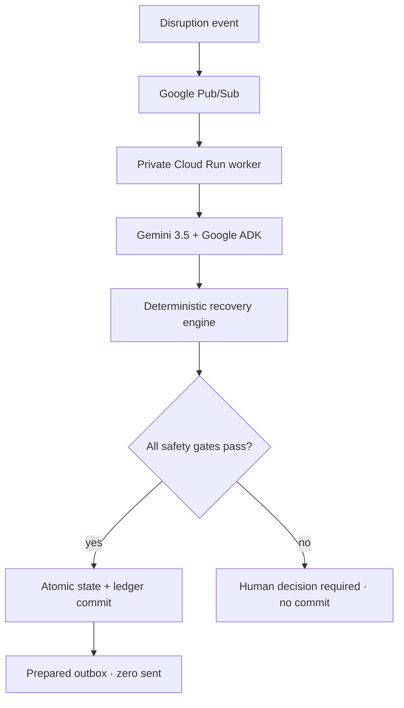

# Places, Again

> **Autonomous operational disruption recovery.** Every organization has
> software for when the plan works. Places, Again is for the moment when the
> plan breaks.

Places, Again turns one operational incident into a completed background
workflow: it measures the blast radius, finds the smallest qualified recovery,
proves the proposed state against deterministic constraints, atomically commits
only a safe plan, and prepares an audited outbox that it cannot send.

Opera is where we know the failure mode firsthand. **Opera is the proving
ground, not the market.** The repository runs the same engine on an opera call
and a commercial film/broadcast shoot.

## Evidence at a glance

| Proof | Opera scenario | Commercial shoot scenario |
|---|---:|---:|
| Affected activities | 3 | 4 |
| Person-hours at risk | 12.0 | 26.0 |
| Activities recovered | 3 | 4 |
| Person-hours restored | 12.0 | 26.0 |
| Unaffected activities moved | 0 | 0 |
| Unresolved activities | 0 | 0 |

- **47/47 labeled evaluation cases pass** across both domains.
- **0 unsafe commits, 0 unresolved auto-commits, 0 duplicate side effects.**
- **100% stale-plan rejection; 100% of accepted plans pass verification.**
- Duplicate Pub/Sub delivery, retry, three injected crash locations, concurrent
  incidents, impossible recovery, malformed data, unknown people/resources,
  and prompt injection are covered.
- External communication remains `prepared_not_sent`; **messages sent = 0**.

The full reproducible result is in
[`reports/evaluation-report.json`](reports/evaluation-report.json). Cloud claims
are deliberately a hard gate: a real deployment is not considered proven until
[`scripts/cloud_e2e_test.py`](scripts/cloud_e2e_test.py) produces its evidence
report against Google Cloud.

## The Taskmaster workflow



The public API persists the incident first and responds with an `event_id`.
Processing continues without a human selecting tools or approving intermediate
steps:

`received → analyzing → planned → verified → committed → outbox_prepared → completed`

The autonomy policy is intentionally narrow:

> **Autonomous where safety can be deterministically proved. Human-gated where
> ambiguity or irreversible external action remains.**

Manual Preview / Commit remains available only as reviewer inspection mode; it
is not the primary Taskmaster workflow.

## Architecture


### Separation of authority

| Layer | Responsibility | Cannot do |
|---|---|---|
| Public Cloud Run API | Strict validation, durable receive, Pub/Sub publish | Call Gemini, commit recovery, send messages |
| Pub/Sub | At-least-once delivery of opaque `event_id` | Read incident text or mutate state |
| Private Cloud Run worker | Authenticated OIDC endpoint, ADK run | Accept public unauthenticated traffic |
| Gemini 3.5 + Google ADK | Orchestrate a three-tool workflow | Override gates, use shell/HTTP, access secrets, send |
| Deterministic engine | Qualification, availability, person/resource conflicts, minimum change | Commit an unresolved or stale plan |
| Firestore transaction | Ledger + version + plan + audit + outbox as one effect | Produce a partial business commit |

Pub/Sub is at-least-once, while Places, Again provides **exactly-once business
effect semantics**. A stable event ID indexes the Firestore ledger. Replaying a
completed event cannot increment the state version or recreate outbox items.

## What is demonstrated — and what is not

Demonstrated now:

- a person-unavailability incident across people, time, rooms/equipment, and
  required qualifications;
- the same generic engine on opera and commercial production data;
- minimum-change recovery under the implemented deterministic policy;
- safe automatic commit, stale-plan rejection, atomic replay protection, human
  escalation, audit, and prepared outbox;
- synthetic data only.

Not claimed:

- global mathematical optimality;
- financial savings without customer data;
- support for healthcare, manufacturing, logistics, or every disruption type;
- use of proprietary employer data;
- external message delivery.

The architecture can be extended to broader time-critical field operations,
but those are future extensions, not current product claims.

## One-command local reproduction

Python 3.12 is recommended.

```bash
python -m venv .venv
.venv/bin/pip install -r requirements-dev.txt
.venv/bin/pytest -q
.venv/bin/python scripts/run_evaluation.py --summary
.venv/bin/uvicorn places_again.web:app --host 127.0.0.1 --port 8000
```

Open `http://127.0.0.1:8000`. Choose **Opera Production** or **Commercial Film /
Broadcast Production**, then click **Inject disruption event** once. In local
mode the same persisted workflow runs in a background task; the production
deployment replaces that transport with Pub/Sub and a private ADK worker.

Additional checks:

```bash
.venv/bin/python scripts/secret_scan.py --history
.venv/bin/python scripts/verify_core.py
```

## One-command Google Cloud deployment

The deployment requires an authenticated Google Cloud CLI session and an
already billing-enabled project. It never chooses a billing account and never
creates or downloads a service-account key.

```bash
bash deploy.sh YOUR_PROJECT_ID
```

The script creates or configures:

- public `places-again` Cloud Run API;
- IAM-private, internal-ingress `places-again-worker` Cloud Run service;
- `places-again-events` Pub/Sub topic and authenticated push subscription;
- Firestore native database;
- dedicated builder, API, worker, and Pub/Sub push service accounts;
- API roles limited to Firestore + Pub/Sub publish;
- worker roles limited to Firestore + Vertex AI;
- Pub/Sub push identity limited to invoking the private worker;
- zero minimum instances and bounded maximum instances.

It then runs a real end-to-end test that:

1. publishes a safe incident and waits for ADK/Gemini completion;
2. verifies plan proof, state version `1 → 2`, and the unsent outbox;
3. replays the same event and proves zero duplicate commit/outbox;
4. sends an impossible/adversarial incident and proves human escalation with no
   state mutation or message.

The deployment transcript and JSON evidence are written under `runtime/`.

The OIDC and ingress setup follows Google Cloud's documented service-to-service
authentication and Cloud Run internal-ingress behavior for Pub/Sub.

## API surface

| Method | Route | Purpose |
|---|---|---|
| `POST` | `/api/events` | Validate, persist, publish; returns `202 + event_id` |
| `GET` | `/api/events/{event_id}` | Workflow state, metrics, proof, observable trace |
| `POST` | `/api/pubsub/push` | IAM-private Pub/Sub worker entrypoint |
| `GET` | `/api/state?scenario_id=…` | Synthetic scenario state |
| `GET` | `/api/capabilities` | Runtime and Google stack evidence |
| `POST` | `/api/demo/preview` | Secondary reviewer inspection mode |
| `POST` | `/api/plans/commit` | Secondary reviewer inspection mode |

No public arbitrary-prompt endpoint exists.

## Repository map

- `places_again/agent.py` — Google ADK agent and explicit three-tool allowlist
- `places_again/workflow.py` — event ledger and atomic exactly-once effects
- `places_again/engine.py` — generic deterministic recovery/safety kernel
- `places_again/repository.py` — JSON local + transactional Firestore adapters
- `places_again/pubsub.py` — opaque event publishing/decoding
- `places_again/models.py` — strict bounded Pydantic input models
- `evaluation/cases.json` — 47 labeled two-domain cases
- `reports/evaluation-report.json` — current reproducible local results
- `SECURITY.md` — threat model and authority boundaries
- `FAILURE_MODES.md` — failure detection and designed behavior
- `JUDGE_EVIDENCE.md` — rubric claim-to-proof map
- `docs/demo-script.md` — public video script, under four minutes
- `docs/submission.md` — Devpost draft

## Security and observability

Incident `reason` is data, never an instruction. The model sees a fixed command
containing only the event ID. The tool allowlist contains no shell, arbitrary
HTTP, secret access, or delivery capability. Structured logs and the ledger
record the correlation/event ID, timestamps, model, observable tool/action
trace, plan and versions, verification, retry count, latency/token metadata when
available, outbox status, and failures—never hidden chain-of-thought.

See [`SECURITY.md`](SECURITY.md) and [`FAILURE_MODES.md`](FAILURE_MODES.md).

## Contest positioning

Primary category: **Taskmaster**. The firsthand friction is backstage opera
recovery; the commercial proof is the second domain. The commercial category is
not “opera scheduling software,” but **Autonomous Operational Disruption
Recovery**.

All names, schedules, and results are synthetic. The entrant must still provide
the public YouTube/Vimeo video, submit the Devpost entry, and make the final
eligibility and employer-policy attestations.

## License

Created by Rareș Păltineanu. MIT licensed; see [`LICENSE`](LICENSE).
